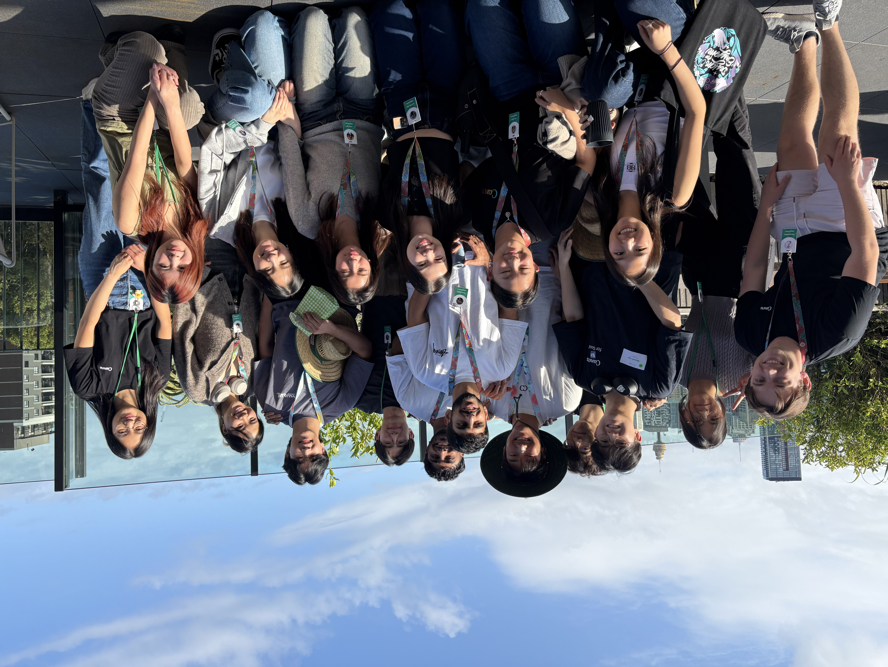
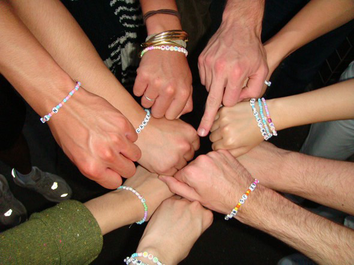

This blog serves as my reflection and learning hub for the [ThoughtSpot SQL course](https://www.thoughtspot.com/sql-tutorial?utm_source=chatgpt.com).

---

## The journey

### How did I end up at Canva?

A bit of background. Canva had always been one of my dream companies for a few reasons:
* I had been using Canva for a long time. In fact, it shocked me that I had been using Canva since year 10 to create stunning infographic designs. I always knew of the product and loved using it, but it never registered that the product was named Canva, and that it was a major technology employer based in Australia until I applied.
* A couple of Canva employees showed up at an uni club trivia night I attended during my first year. One question was: 'where was Canva founded?' I blindly guessed Perth, and somehow got it right. Ever since then, I had been enamoured by Canva. Perhaps it was the inspiration that came with seeing an amazing product originate from own hometown.

So without hesitation, I applied. It was a longshot. I knew just how competitive it would be. In fact, I later found out that just 89 interns were taken from a pool of ~ 7000 applicants. But after an online assessment and a technical plus behavioural interview, I had made it in.

### Week 1 - Onboarding

Onboarding week swiftly came and went. We were taken through ample modules and setup the software necessary for our projects (e.g. Snowflake, GitHub, Accessing Data Warehouse). I also met my support team - including my host, co-host and buddy - who were all super smart & lovely people, and discussed my intern project with my host!

All the interns spent the first week from the comfort of their home (or closest office), which meant that I explored the amazing Melbourne office. A small, cosy and humble abode in the heart of Collingwood, the Melbourne office had delicious breakfast and lunched served up by the chefs, a friendly vibe team who greeted you every morning, great background music, free merch at the swag station and sick artwork fit for a design company.

### Week 2 - Campus week

Campus week was when the fun really began - especially since I was sick during week 1. All the interns were flown to Sydney and given accommodation for a week, which meant some of us (myself included) got to meet our team in person, there were plenty of intern activities planned and we capped off the week with the annual Canva end-of-year party!  

Let me tell you, the party was amazing. There was plenty of music (including a dance floor) to keep the vibes high, the street was decked out for us with food trucks, we attended stand-up comedy, learned how to shoot arrows and bonded over alcohol on the rooftop. Actually, we could've gotten drunk anytime with beer taps and alcohol readily available on the Sydney office rooftop.  

I'm going to be completely transparent. I didn't get much work done this week. There were just too many intern events - both during and outside of work hours - that I didn't find the time to fully concentrate on my intern project. Fortunately, my team had told me to enjoy myself this week and not worry too much about work.

### Weeks 3 to 8 - Sydney

I decided to stay in Sydney for a few extra weeks - even after the all-expenses-paid Campus Week had wrapped up. My reasoning? I felt there was so much more Syndey could offer professionally and socially. I was fortunate in both of these aspects.  

Professionally, most of the product Data Scientists were located in Sydney including my host, co-host and buddy. This meant that I could better connect with my team and learn a heck of a lot more (scroll down to find my key learnings). In fact, those two months felt jam-packed with personal milestones that I could celebrate with the team - including an engagement, baby announcement and permanent residency approval! Even though I wish I could've seen my team a bit more - many came in just once a week - I totally get why, and I still had an amazing time with them.

Even though I wish I could've seen my team a bit more as many came in just once a week, I totally get why they couldn't come in more often and still had an amazing time with them. Plus, I had my buddy next to me four days a week!

Socially, Sydney had more people. Especially interns. While I do wish I had taken the opportunity to mingle with more interns, I truly feel blessed to have gotten close to some amazing ones - especially those that also relocated from other states & stayed at Iglu accommodation. We would regularly explore the many wonders of Sydney (Bondi beach, Harbour bridge, Opera House, Manly etc), play games (Exploding Kitten, Codenames, Switch) and work together. I never felt there was a second to spare as some activity had always been planned for the weekend.  

Canva clubs were also a major highlight. You were allowed to attend up to four club-sponsored events each month, which meant the entire experience would be on the house! I was able to try out new activities like pilates (with my team) and pickleball, and indulge in treats like yo-chi, all for the price of ... NOTHING! Who doesn't love free stuff, all the while feeling part of a community :o

### Weeks 9 to 11 - Melbourne

The palpable sorrow felt from leaving all of my amazing friends and team in Sydney started to hit my first day back. Although I had been to the Melbourne office once prior, I never realised just how difficult it was to commute to from my house (~ 1hr 15 mins). In spite of this, my experience back in Melbourne was much the same.  

I had made significant progress on my project - receiving positive feedback from key stakeholders and collaborating with a PM on a new feature that came from my report, and was set for experimentation. Safe to say, the last couple of weeks were extremely busy for everyone.  

Immersing myself into the Melbourne office culture wasn't too difficult. Though, there were only around 10 interns and with everyone working overtime, it was difficult to organise many social outings. You wouldn't believe the crazy hours some interns pulled. Alas, I knew when I worked best and prioritised waking up feeling refreshed.  

Despite less social events, I still had a great time. I was able to meet a few teammates who were based out of Melbourne - even finding out one of them came from Perth aswell! We organised pickleball and basketball amongst the interns during these final few weeks, and enjoyed the lovely food (arguably better than Sydney's) made in-house by the chefs. I would also describe general vibe among the Melbourne office as more 'cosy' - chill music playing, a closer-knit community and physical proximity all contributed to this change of scenery. 

### Week 12 - Presentations

The juxtaposition of the final week to the first week was immense. The last push to finish our work, submit our personal reflections & presentations and mingle with our peers one last time meant there was little time for much else. The Data Science interns gave a presentation among most Data Scientists at Canva at the start of the week, and all interns gave their final intern presentation on Wednesday and Thursday. Being in product, I was given the opportunity to present 1st among all Data Scientists and 2nd among all 89 interns. It was quite the double-edged sword. On the one hand, I would be free from comparison prior to my presentation and would have the most crowd engagement (lots of interns shouting their support in the chat). On the other hand, since our presentations were broadcasted to the entire company, I would have the most eyes on me (which is also kind of good).  

My presentations went well as I received positive feedback all around. However, comparison being the thief of joy that it is - it was hard not to compare my work to other interns (especially Data Scientists). For whatever reason, I felt that my work didn't sound as 'impactful' or 'cool' as other interns - which was probably not true - and found myself always comparing. Reflecting back, it's good to appreciate the amazing work other's do but don't forget all the work you've put in to deliver your best go at a challenging problem.  

### Week 12 - Final day

After the stress that came with presentations, it was time to wind down and relax on the final day. I said my goodbyes to everyone - especially my team - expressing my gratitude for the impact that so many Canvanauts had on my career. In particular, my coach/host. I could not have asked for a better host and felt genuinely sad that I wouldn't be working alongside him anymore. He always gave my credit - giving me many kudos on Canvaworld - and made sure that everything was okay personally before getting into any work-related topics. He even organised a suprise final meeting with all the product Data Scientists where they gave me four cans of berry jam (berries are my favourite fruit), a basketball book (I love basketball) and some berry tea.  

There is honestly too much that went on during this final week to describe in depth and so I may have missed some details.

### Final remarks

A few months have passed and the dust has settled on the internship. I'm back at university now - completing an industry placement - but can't help myself from reminiscing on the wonderful 12-week experience I had over the summer. Although we all received our decision calls regarding return offers, and most interns didn't recieve one (including myself), I still feel as if I can walk away proud of everything I achieved and all the memories I created. 

---

## Learnings

Here are a couple of key learnings that I hope to apply at my upcoming graduate role.

1. **Quantifying impact is difficult as a Data Scientist**, so be proactive and setup regular meetings with stakeholders to discuss the impact of your work. However, make the meeting all about you, and how you can quantify your impact. A better use of both parties' time would be to use the meeting to discuss quantitative insights you've found and how they may be used (e.g. new feature ideas, modifications to existing features). Always follow up with estimated timelines of any new ideas proposed by the other party. For example, I was able to quantify the impact of my research report by hosting a meeting with a product manager, who discussed their new feature idea that my research supported.

2. **Always ask 'so what'?** So what is the impact of the insight? So what is its important? So what can we do about it? These questions are now what I will call the three 'so whats' - which if kept in the forefront of your mind, will keep you on track. While I'm gaining business acumen, it may be difficult to see the big picture, or to tie an insight to some impactful action (what can we do about it?). To remedy this, ask around. Propose the idea to your manager, teammates, and product managers to pick their brain on the insight to see whether it's truly relevant, and can not only be impactful, but deliver **feasible business results**.

3. **Get to know EVERYONE in your team by setting up coffee catchups**. This is definitely one area of improvement. At the conclusion of my internship, I felt comfortable asking for advice from the few teammates I regularly interacted with on the project, but I knew I had missed a major opportunity by not getting to know everyone in my team (atleast) better from the start. **First impressions are key**. Being proactive in setting up coffee catchups to get to know others personally and showing curiosity in their work/roles will help me to feel more welcome (it's really up to me to feel part the team), and have more avenues for support. Seeing other interns (especially Viv) network has really inspired me to do the same.

4. **Come prepared for important meetings with an agenda**. This is one area I did well in. I had a continuous agenda doc that I would prepopulate with topics that I wanted to cover in all my one-on-ones with my manager. The agenda doc wasn't complicated - simply a table with dot-points. I also found that creating and sharing an agenda for important meetings with stakeholders (e.g. product managers), with topics and ideas to already there to discuss really helped in facilitating the conversation. Preparing in this way for my meeting with the AI product manager, and asking my coach to review the agenda helped to demonstrate my professionalism and come out of the meeting with something valuable. Remember, **people are busy, so make the most of the meeting by coming prepared**.

5. **Set expectations with your manager early**. Inevitably, you will go through a formal performance review. To position yourself for success, ensure your first few meetings establish both parties expectation and interpretation of your growth profiles. Moreover, regular conversations with not just your manager, but other senior employees in the same field are so important for understanding how to perform above and beyond expectations. I would recommend setting aside at least a **bi-weekly meeting** to discuss your performance, career aspirations, and establish a plan to achieving these goals. This might include "completing project X".

6. **Keep yourself informed about the internals of the company**. Upon reflection, I regrettably feel as if I had not paid enough attention to keeping up-to date with internal business developments/projects. Moving forward, I intend to give my undivided attention to town halls, read trending confluence pages, and develop greater business awareness to ensure I can tie my work back to [OKRs](https://www.atlassian.com/agile/agile-at-scale/okr) (Objectives and Key Results) when completing my performance review.

7. **Create a brag book**. Towards the end of my internship, a teammate advised me to create a book/spreadsheet of all my accomplishments and their impact. While I hadn't maintained one throughout my internship, I undoubtedly see immense value in doing so - especially when completing performance reviews. Moving forward, I intend to adopt an [online template](https://netwerkmovement.com/how-to-create-a-brag-book/) that documents all my professional achievements and tasks, no matter how little.

8. **Develop your product sense**; regularly use and actively learn about the products of your company. This is an area I excelled in which paid dividends. Embedded in the Canva Docs team, I dedicated myself to learning about the product, leading to a strong product sense and understanding of how our users might engage with it. For instance, I discovered an AI feature was of the upmost importnance for user engagement. Moving forward with this mindset of curiosity will be essential as I look to work as a product Data Scientist in the future.

9. **Meaningful project names matter**, especially as you must become your strongest proponent to have a successful career in Data Science. Pitch your work, sell its importance and increase your visibility. What's the point in doing work if no-one uses it, sees its value, or remembers it? My coach always comes up with a catchy project name that people will remember and could associate to an idea. After tossing around some ideas with my team, I named my project 'Sweet Suite Adoption' - a nod to both the 'sweet' Canva suite and its goal: improving user adoption of those products.