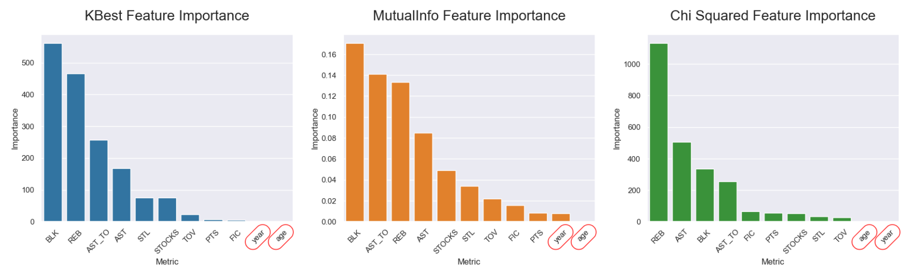

For as long as I can remember, I have been in love with basketball.  

While I could never become an NBA player myself, us data fanatics are fortunate there exists an abundance of rich basketball data. This opens up a world of interesting projects, with [positionn](https://www.danielliu.xyz/projects/positionn/) serving as an app to predict your ideal NBA position and the players you most closely resemble.  

This article provides a comprehensive overview of the process, learnings, and improvements from months of model development using machine learning techniques.  

---

## Step 1: Data Retrieval

The [NBA API](https://github.com/swar/nba_api) is a free-to-use Python package to access the APIs for NBA.com. Without going into too much detail, as it isn't the premise of this article, I wrote a [script](https://github.com/danielliu2707/positionn/blob/main/01_scrape_data.py) that fetches and preprocesses player data between the 2015-2026 NBA seasons.  

The data includes:
* **Basic player statistics:** points, rebounds, assists, steals, blocks etc, to build the model on.
* **Player headshots:** to display NBA players with similar statistics using their headshot images.

---

## Step 2: Data preprocessing & feature engineering

While the NBA API provided high-quality data, there were a few notable issues which I remedied in the [preprocessing notebook](https://github.com/danielliu2707/positionn/blob/main/02_stats_preprocessing.ipynb):
* My data retrieval script often crashed from the size of the dataset requests posted to the NBA API, forcing data retrieval in batches. I subsequently merged these batches in this stage of preprocessing.
* I computed commonly used advanced metrics, such as assist-to-turnover-ratio, stocks, and FIC, all of which are calculations formed from the basic statistics I already had.
* The assist-to-turnover-ratio had 20 observations with an `Inf` value. This occurs when the NBA player recorded 0 turnovers in a season, resulting in a division by 0, creating `Inf` values. These records were removed.

---

## Step 3: Problem Definition

The objective of Positionn is to accurately predict the position (Guard, Forward, Center) a user would play based on their basic statistics. Using the retrieved and preprocessed data, we could train a model to assist us with this **multi-class classification** problem.  

Before any training, I discovered the dataset was mildly imbalanced, with 1,781 Guards, 1476 Forwards, and 559 Centers. Since we want fair predictive performance across all classes, I decided to proceed using the following metrics for imbalanced datasets:

* **Balanced accuracy**: Averages how well the model correctly identifies each class, so rare classes count just as much as common ones.
* **F1 macro**: Computes the F1 score for each class independently (balancing precision and recall per class) and then takes the average. This treats all classes equally regardless of their frequency, making it suitable for imbalanced datasets.

---

## Step 4: Feature Selection

To ensure the importance of player statistics in my dataset, I used the `SelectKBest()`, `mutual_info_clasif()`, and `SelectKBest(score_func=chi2)` methods to give a general score to each feature (see below).



* From the visualisations, I decided to prune out `age` and `year`. These were consistently the least important attributes across all three importance measures.

---

## Step 5: Training & Comparing different models

To ensure a sufficient description of the major types of models I tried, I will separate the training process description into steps for the **basic models** and **gradient boosting models**.

### Basic Models

The initial model in production, a support vector machine with gridsearch hyperparameter tuning, was the best performing model in terms of its **nested cross-validation** balanced accuracy and f1 scores. This was selected from a subset of model families which include:
* Logistic Regression
* Decision Tree
* Random Forest
* Histogram Gradient Boosting
* Support Vector Machine

To ensure a fair evaluation process, all models were trained using the same general process. I will now describe `PlayerStatisticsModel`, a class with the methods for training & evaluating these basic models.  

**First, I defined the initialisation of the `PlayerStatisticsModel` class.**

```
class PlayerStatisticsModel:
    def __init__(
        self, model, preprocessor: ColumnTransformer,
        data: pd.DataFrame, target: pd.Series, cv: int
    ):
        """
         Initialisation of PlayerStatisticsModel class.
        
         Inputs:
          - model: sklearn machine learning model class
          - preprocessor (ColumnTransformer): preprocessing steps
          - data: input features
          - target: input target
          - cv: number of cv folds to estimate generalisability of model
        """
        self.metrics = ["balanced_accuracy", "f1_macro"]  # metrics to evaluate/fit models
        self.cv = cv  # number of cv folds
        self.results = pd.DataFrame()   # dataframe to store performance results of models
        self.data = data
        self.target = target
        self.X_train, self.X_test, self.y_train, self.y_test = train_test_split(data, target, test_size = 0.25, stratify=target, random_state=42)
        self.preprocessor = preprocessor
        self.model = Pipeline(
            steps=[
                ("preprocessor", preprocessor),
                ("model", model)
            ]
        )
```

* Notably, every model trained using the `PlayerStatisticsModel` class will use the same train/test split as we set `random_state=42`.
* The Scikit-Learn `model` passed to the class object, such as `LogisticRegression()` or `DecisionTreeClassifier()`, fits into the `Pipeline()`, with preprocessing (i.e. standard scaling) applied.

**Next, I defined the `.cv_score()` method to run basic cross-validation on `self.model.**

```
def cv_score(self, model_name: str) -> tuple[dict[list], dict[list]]:
    """
     Runs cross-validation on the default model (i.e. without hyperparameter tuning), obtaining the performance of the model.

     Inputs:
      - model_name (str): name of the model that will exist as its index in the self.results df

     Returns:
      - dict_scores_agg (dict[list]): dictionary containing the mean & std results for each model metric
      - dict_scores_folds (dict[list]): dictionary containing the model metric results for each fold
    """   
    # get CV scores for default model
    dict_scores_agg = dict()
    dict_scores_folds = dict()
    for metric in self.metrics:
        cv_results = cross_validate(self.model, data, target, cv=self.cv, scoring=metric)
        scoring = cv_results['test_score']
        dict_scores_agg[metric] = (scoring.mean(), scoring.std())
        dict_scores_folds[metric] = scoring
    self._add_model_results(dict_scores_agg, model_name)
    return dict_scores_agg, dict_scores_folds
```

* You will notice the results from each cross-validation fold is stored in dictionaries `dict_scores_agg` and `dict_scores_folds`. These store the average and fold-specific balanced accuracy and f1 scores of the model. 
* The results are then added to a record of different model performances by calling the `self._add_model_results()` helper function.

**Since we will continue to use `self._add_model_results()` helper method, let's formally define it.**

```
def _add_model_results(self, model_result: dict[list], model_name: str):
    """
     Anonymous method that concatenates the mean and standard deviation cross-validation score for all specified metrics of a model onto a 
     pre-existing dataframe (self.results). This enables us to quickly
     compare the cv-performance of models as we build them.

     Inputs:
      - model_result (dict[list]): dictionary containing the mean & std results for each model metric
      - model_name (str): name of the model that will exist as its index in the self.results df
    """   
    # Gets model results as df to append to self.results
    df = pd.DataFrame(model_result)

    # extract rows and add suffixes to column names, then combine
    mean_row = df.iloc[0].rename(lambda col: f"{col}_mean")
    std_row = df.iloc[1].rename(lambda col: f"{col}_std")
    flattened_series = pd.concat([mean_row, std_row])
    flattened_df = pd.DataFrame([flattened_series])

    # set the index to the model name
    flattened_df.index = [model_name]

    # if model already exists in results df, then replace. Otherwise, append.
    if model_name in list(self.results.index):
        self.results.loc[model_name] = flattened_df.iloc[0]
    else:
        self.results = pd.concat([self.results, flattened_df])
```

* This helper method appends the mean and standard deviation balanced accuracy and f1 cross-validation scores to `self.results`, a dataframe to quickly compare the cv performance of models as we build them.

**We define another convenience method, `.print_cv_results()`, which prints the mean and standard deviation cross-validation score in a pretty format.**

```
def print_cv_results(self, dict_results:dict[tuple]):
    """
     Prints the mean and standard deviation cross-validation score for a specified metrics in a pretty format.
    
     Inputs:
      - dict_results (dict[tuple]): the mean & std results of a model on all evaluation metrics
    """
    for metric, value in dict_results.items():
        print(f"The mean cross-validation {metric} score is: "
        f"{value[0]:.3f} ± {value[1]:.3f}")
```

**Next, we define a general method `.grid_search_cv_score()` to fit and tune a models hyperparameters with gridsearch, performing *nested cross-validation* to estimate its balanced accuracy and f1 on unseen data.**

```
def grid_search_cv_score(self, model_name: str, param_grid: dict):
    """
     Fits a model with grid_search to tune its hyperparameters. Then performs
     nested cross-validation to obtain an estimate of the generalisability
     of the model & variance of this estimate.

     Inputs:
      - model_name (str): name of the model that will exist as its index in the self.results df
      - param_grid (dict): grid of hyperparameters to iterate through
     
     Returns:
      - dict_scores_agg (dict[list]): dictionary containing the mean & std results for each model metric
      - dict_scores_folds (dict[list]): dictionary containing the model metric results for each fold
      - best_model: sklearn model of best performing model after gridsearch hyperparameter tuning
    """
    with self._suppress_warnings_and_output():
        model_grid_search = GridSearchCV(self.model, param_grid=param_grid, n_jobs=-1, scoring=self.metrics, refit=self.metrics[0], verbose=1)

        # fit grid search on training data to extract best model
        model_grid_search.fit(self.X_train, self.y_train)
        best_model = model_grid_search.best_estimator_

        # get nested CV scores for best model
        dict_scores_agg = dict()
        dict_scores_folds = dict()

        # perform nested cv for each metric, storing results in dictionaries
        for metric in self.metrics:
            cv_results = cross_validate(model_grid_search, data, target, cv=self.cv, n_jobs=-1, scoring=metric)
            scoring = cv_results['test_score']
            dict_scores_agg[metric] = (scoring.mean(), scoring.std())
            dict_scores_folds[metric] = scoring

        # add results to dataframe for easy model comparison
        self._add_model_results(dict_scores_agg, model_name)
        return dict_scores_agg, dict_scores_folds, best_model
```

* The method requires `param_grid`, a grid of hyperparameter values to try on the model.
* Only the best performing model will have its performance and pipeline model returned.

**Similarly, we define a general method `.randomised_search_cv_score()` to fit and tune a models hyperparameters with randomsearch, performing *nested cross-validation* to estimate its balanced accuracy and f1 on unseen data.**

```
def randomised_search_cv_score(self, model_name: str, param_distributions: dict, n_iter: int):
    """
     Fits a model with randomised_search to tune its hyperparameters.
     It Then performs nested cross-validation to obtain an estimate of the 
     generalisability of the model & variance of this estimate.

     Inputs:
      - model_name (str): name of the model that will exist as its index in the self.results df
      - param_distributions (dict): range of possible values each hyperparameter that can be sampled
      - n_iter (int): number of iterations to run randomised_search (i.e. models to be fitted & evaluated)
     
     Returns:
      - dict_scores_agg (dict[list]): dictionary containing the mean & std results for each model metric
      - dict_scores_folds (dict[list]): dictionary containing the model metric results for each fold
      - best_model: sklearn model of best performing model after gridsearch hyperparameter tuning
    """
    with self._suppress_warnings_and_output():
        model_random_search = RandomizedSearchCV(self.model, param_distributions=param_distributions, n_iter=n_iter, n_jobs=-1, scoring=self.metrics, refit=self.metrics[0], verbose=1)
        # fit grid search on training data to extract best model
        model_random_search.fit(self.X_train, self.y_train)
        best_model = model_random_search.best_estimator_
        # get nested CV scores for best model
        dict_scores_agg = dict()
        dict_scores_folds = dict()
        # perform nested cv for each metric, storing results in dictionaries
        for metric in self.metrics:
            cv_results = cross_validate(model_random_search, data, target, cv=self.cv, n_jobs=-1, scoring=metric)
            scoring = cv_results['test_score']
            dict_scores_agg[metric] = (scoring.mean(), scoring.std())
            dict_scores_folds[metric] = scoring
        # add results to dataframe for easy model comparison    
        self._add_model_results(dict_scores_agg, model_name)
        return dict_scores_agg, dict_scores_folds, best_model
```

* The method requires `param_distributions`, a range of hyperparameter values to try on the model.

**What is the difference between grid search and randomised search?**

* Answer question to explain rationale!

**Why do we need nested cross-validation for evaluating and selection of models when performing hyperparameter tuning?**

* Answer question to explain rationale!


**While we returned the performance and tuned model itself, the gridsearch and randomised search methods did not provide us with the tuned hyperparameters themselves. The `.get_best_tuned_params()` method provides this desired functionality.**

```
def get_best_tuned_params(self, best_model, param_grid: dict):
    """
     Gets the best tuned parameters for a model after gridsearch
     or randomised_search hyperparameter tuning.

     Inputs:
      - best_model: sklearn model of best performing model after hyperparameter tuning
      - param_grid (dict): grid of hyperparameters to iterate through
     
     Returns:
      - dictionary of tuned parameters and their values for the best model
    """
    params = [param for param in best_model.get_params() if param.startswith('model__') and param in list(param_grid.keys())]

    params_values = [best_model.get_params()[param] for param in params]

    return dict(zip(params, params_values))
```

**In some ad-hoc instances, I was interested in reinforced the superiority of a model by comparing the individual fold performance between two models, plotting their balanced accuracy and f1 scores. The `.plot_fold_comparison()` method does this.**

```
def plot_fold_comparison(self, metric: str, fold_results: tuple[list[int]], label_names: tuple[str], colors: tuple[str]):
    """
     Plots a comparison of the model's evaluation metric (i.e. performance)
     on each individual cross-validation fold. If there are 4
     cross-validation folds, a scatterplot with four dots will be plotted.
    
     Inputs:
      - metric (str): sklearn evaluation metric of choice
      - fold_results (tuple[list[int]]): tuple containing the fold results of each model
      - label_names (tuple[str]): names to give each to each model in the legend of plot
      - colors (tuple[str]): colors to give each model in the plot
    """
    # handle edge case: user passes in invalid metric to plot
    if metric not in self.metrics:
        raise Exception(f"Please pass in a valid metric: {self.metrics}")
    else:
        fig, ax = plt.subplots(figsize=(6, 5))

        # iterate through each model's fold_result, adding scatterplots
        for i in range(len(fold_results)):
            indicies = np.arange(len(fold_results[i][metric]))
            sns.scatterplot(x=indicies, y=fold_results[i][metric], color=f"tab:{colors[i]}", label=label_names[i], ax=ax)

        # plot axis settings
        ax.set_xlabel("Cross-validation iteration")
        ax.set_ylabel("Balanced Accuracy")
        ax.set_title(f"{self.cv}-Fold {metric}")
        ax.set_xticks(np.arange(0, self.cv))
        ax.set_ylim(0,1)
        ax.legend(bbox_to_anchor=(1.05, 1), loc="upper left")
```

For instance, we used this method to visualise a comparison between the cross-validation folds of the best performing logistic regression and tree models.  

* Insert image here!!! (--- Comparison of folds between best Logistic Regression & Decision Tree models ---)  

Mostly, this method was not extremely useful.

**Finally, you may have noticed I used the `._suppress_warnings_and_output()` helper method throughout the previous methods. Its purpose is to suppress annoying output warning messages from running gridsearch or randomised search.**  

```
@contextmanager
def _suppress_warnings_and_output(self):
    # save original warning environment variable
    original_warnings = os.environ.get("PYTHONWARNINGS", "")
    
    # suppress UserWarning and FutureWarning
    os.environ["PYTHONWARNINGS"] = "ignore::UserWarning, ignore::FutureWarning"
    warnings.filterwarnings("ignore", category=UserWarning)
    warnings.filterwarnings("ignore", category=FutureWarning)

    # capture all stdout/stderr output
    with io.capture_output() as captured:
        try:
            yield captured
        finally:
            # restore warnings environment and filters
            os.environ["PYTHONWARNINGS"] = original_warnings
            warnings.filterwarnings("default", category=UserWarning)
            warnings.filterwarnings("default", category=FutureWarning)
```


Continue describing how I used these methods to train a single model. Provide an example (e.g. LogisticRegression). 

Show the end result after model training. (i.e. the final table). One thing that catches my eye is that both Gradient Boosting methods outperformed any of the basic methods. So how did we go back Gradient Boosting (the final models in production after I found they outperformed svms; mention how they were a late addition).


### Gradient Boosting Models


---


**Note:** Big Mistake: Training on player_id. Forced me to re-run my entire workflow and assess whether any model rankings changed. LGBM still remained best model. 


****


---

This article provides my comprehensive overview of XGBoost; the algorithm and  package in Python.

---


## Ensemble Learning

Ensemble learning is a technique that combines multiple individual models, aggregating their predictions, to produce better predictions than a single model alone. XGBoost is a form of ensemble-based learning, so it feels natural to begin by describing this effective method of building models. common ensemble-based methods are bagging and boosting.

### Bagging (Boostrap Aggregating)

Bagging involves training the same model on multiple bootstrap samples (i.e., randomly sampled with replacement from the training data). This produces several individual models, each trained on variations of the training set. The final prediction is the aggregate of the individual model predictions - usually their average (for regression) and majority (for classification).


### Boosting

Boosting is a sequential ensemble method where 'weak' models are trained one after another. Each new model focuses on the errors made by the previous models, placing greater weight on examples that were previous mispredicted. This ensures the ensemble incrementally improves its performance as more models are added. The final predictor is the weighted sum of all 'weak' models - not just the last one.


### Bagging vs Boosting

| Property             | Bagging                                        | Boosting                                                 |
| -------------------- | ---------------------------------------------- | -------------------------------------------------------- |
| Training             | Parallel (independent models)                  | Sequential (each depends on previous)                    |
| Focus                | Reduce variance w/ independent, diverse models | Reduce bias by iteratively improving upon weaknesses     |
| How models differ    | Resampled data                                 | Error focus                                              |
| Final prediction     | Average / vote                                 | Weighted sum                                             |
| Typical base learner | Strong (e.g. full trees)                       | Weak (e.g. shallow trees/stumps)                         |  |
| Algorithms           | Random Forest                                  | AdaBoost, Gradient Boosting, XGBoost, LightGBM, CatBoost |

## History of Boosting

### AdaBoost

We begin the Boosting story with AdaBoost, where misclassified samples are assigned higher weights for the next model, so the next model pays more attention to them. This idea doesn't generalise well to common scenarios nowadays; regression, arbitrary loss, or sparse data.

### Gradient Boosting

Instead of simply reweighting samples to focus on mistakes, Gradient Boosting reframes AdaBoost as an optimisation problem. Rather than having each iterative model predict the target directly, each new tree predicts the **residuals** (mistakes) of the current ensemble's predictions.

### Example: House price prediction

As a starting point, suppose the model predicts the same value for every house, say `$350k`. The true prices might be:

- `y = [$200k, $300k, $400k, $500k]`

Then the initial predictions are:

- `y_hat = [$350k, $350k, $350k, $350k]`

and the initial residuals are:

- `r_i = y_i - y_hat_i = [$-150k, $-50k, $+50k, $+150k]`

These residuals represent **what the current model has failed to explain**. Under squared error loss, they are also equal to the **negative gradient** of the loss with respect to the predictions.

For squared error, the loss for a single sample is:

- `L(y, y_hat) = 0.5 * (y - y_hat)^2`

If you take the derivative of this with respect to `y_hat`, you get:

- `dL/dy_hat = (y_hat - y)`

The **negative gradient is therefore the residual**:

- `-(dL/dy_hat) = y - y_hat = r_i`

So when Gradient Boosting trains the next weak model (usually a shallow tree), it does **not train it on the original house prices `y`. Instead:

- The **features** (e.g. bedrooms, size, suburb) stay the same.
- The **targets** become the residuals `r_i`.

We're no longer predicting the full price. We're predicting **corrections** that tell us how far our existing model is from a perfect one.

After training this tree `h_1(x)`, we update the model:

- `F_1(x) = F_0(x) + η * h_1(x)`

where `η` (eta) is the learning rate. Because `h_1(x)` approximates the negative gradient (the direction of steepest descent), adding it reduces the loss.

Gradient Boosting repeats this process:

1. Compute residuals `r_i = y_i - F_{m-1}(x_i)` (for squared loss; more generally, use negative gradients).
2. Fit a shallow tree `h_m(x)` to `(x_i, r_i)`.
3. Update the model: `F_m(x) = F_{m-1}(x) + η * h_m(x)`.

Each tree is a **small correction step** in the direction that most reduces the loss. This is mathematically the same idea as gradient descent, except instead of updating weights directly (like in a neural network), Gradient Boosting updates the **function** itself by adding trees.

#### Analogy

Think of writing an essay and getting feedback:

1. You write a first draft (initial model).
2. The teacher marks mistakes and comments (these are like residuals).
3. You fix only those mistakes (fit a model to the residuals).
4. You submit again and get a new set of corrections.
5. You fix those and repeat.

You don’t rewrite the entire essay from scratch each time — you only correct **what remains wrong**. After enough rounds of focused corrections, the essay becomes strong.

Gradient Boosting works the same way: each tree is a small correction pass over the current model. Individually, the trees are weak, but together they form a powerful predictor.

## eXtreme Gradient Boosting (XGBoost)

XGBoost is an industry-favourite for its speed, scalability, and flexibility. It extends on the classic Gradient Boosting idea of having each new tree predict the **residuals** (mistakes) of the current ensemble's predictions with the following:
* Reguluarisation
* Optimisation
* Flexibility

Here is an [excellent article](https://medium.com/analytics-vidhya/what-makes-xgboost-so-extreme-e1544a4433bb) that describe XGBoost under-the-hood.

Here is another [article](https://medium.com/@heyamit10/xgboost-explained-d215f091fb85) that details practical applications of XGBoost and Optuna for hyperparameter tuning.