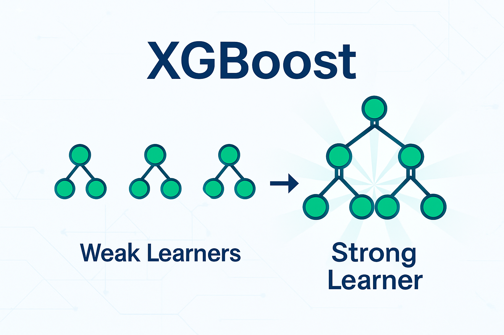
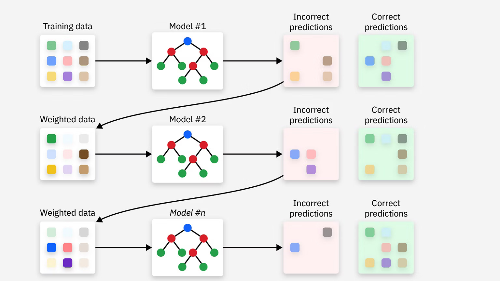

For as long as I can remember, I have been in love with basketball.  

While I could never become an NBA player myself, us fans are fortunate there exists an abundance of rich data. This opens up a world of interesting projects, with [positionn](https://www.danielliu.xyz/projects/positionn/) serving as an app to predict your ideal NBA position and the players you most closely resemble.  

This article provides a comprehensive overview of the process, learnings, and improvements from months of model development using machine learning techniques.  

---

## Step 1: Data Retrieval

The [NBA API](https://github.com/swar/nba_api) is a free-to-use Python package to access the APIs for NBA.com. Without going into too much detail, as it isn't the premise of this article, I wrote a [script](https://github.com/danielliu2707/positionn/blob/main/01_scrape_data.py) that fetches and preprocesses player data between the 2015-2026 NBA seasons.  

The data includes:
* **Basic player statistics:** points, rebounds, assists, steals, blocks etc, to build the model on.
* **Player headshots:** to display NBA players with similar statistics using their headshot images.

---

## Step 2: Data preprocessing & feature engineering

While the NBA API provided high-quality data, there were a few notable issues which I remedied in the [preprocessing notebook](https://github.com/danielliu2707/positionn/blob/main/02_stats_preprocessing.ipynb):
* My data retrieval script often crashed from the size of the dataset requests posted to the NBA API, forcing data retrieval in batches. I subsequently merged these batches in this stage of preprocessing.
* I computed commonly used advanced metrics, such as assist-to-turnover-ratio, stocks, and FIC, all of which are calculations formed from the basic statistics I already had.
* The assist-to-turnover-ratio had 20 observations with an `Inf` value. This occurs when the NBA player recorded 0 turnovers in a season, resulting in a division by 0, creating `Inf` values. These records were removed.

---

### Step 3:

Big Mistake: Training on player_id. Forced me to re-run my entire workflow and assess whether any model rankings changed. LGBM still remained best model. 

****

---

This article provides my comprehensive overview of XGBoost; the algorithm and  package in Python.

---

## Ensemble Learning

Ensemble learning is a technique that combines multiple individual models, aggregating their predictions, to produce better predictions than a single model alone. XGBoost is a form of ensemble-based learning, so it feels natural to begin by describing this effective method of building models. common ensemble-based methods are bagging and boosting.

### Bagging (Boostrap Aggregating)

Bagging involves training the same model on multiple bootstrap samples (i.e., randomly sampled with replacement from the training data). This produces several individual models, each trained on variations of the training set. The final prediction is the aggregate of the individual model predictions - usually their average (for regression) and majority (for classification).

### Boosting

Boosting is a sequential ensemble method where 'weak' models are trained one after another. Each new model focuses on the errors made by the previous models, placing greater weight on examples that were previous mispredicted. This ensures the ensemble incrementally improves its performance as more models are added. The final predictor is the weighted sum of all 'weak' models - not just the last one.

### Bagging vs Boosting

| Property             | Bagging                                        | Boosting                                                 |
| -------------------- | ---------------------------------------------- | -------------------------------------------------------- |
| Training             | Parallel (independent models)                  | Sequential (each depends on previous)                    |
| Focus                | Reduce variance w/ independent, diverse models | Reduce bias by iteratively improving upon weaknesses     |
| How models differ    | Resampled data                                 | Error focus                                              |
| Final prediction     | Average / vote                                 | Weighted sum                                             |
| Typical base learner | Strong (e.g. full trees)                       | Weak (e.g. shallow trees/stumps)                         |  |
| Algorithms           | Random Forest                                  | AdaBoost, Gradient Boosting, XGBoost, LightGBM, CatBoost |

## History of Boosting

### AdaBoost

We begin the Boosting story with AdaBoost, where misclassified samples are assigned higher weights for the next model, so the next model pays more attention to them. This idea doesn't generalise well to common scenarios nowadays; regression, arbitrary loss, or sparse data.

### Gradient Boosting

Instead of simply reweighting samples to focus on mistakes, Gradient Boosting reframes AdaBoost as an optimisation problem. Rather than having each iterative model predict the target directly, each new tree predicts the **residuals** (mistakes) of the current ensemble's predictions.

### Example: House price prediction

As a starting point, suppose the model predicts the same value for every house, say `$350k`. The true prices might be:

- `y = [$200k, $300k, $400k, $500k]`

Then the initial predictions are:

- `y_hat = [$350k, $350k, $350k, $350k]`

and the initial residuals are:

- `r_i = y_i - y_hat_i = [$-150k, $-50k, $+50k, $+150k]`

These residuals represent **what the current model has failed to explain**. Under squared error loss, they are also equal to the **negative gradient** of the loss with respect to the predictions.

For squared error, the loss for a single sample is:

- `L(y, y_hat) = 0.5 * (y - y_hat)^2`

If you take the derivative of this with respect to `y_hat`, you get:

- `dL/dy_hat = (y_hat - y)`

The **negative gradient is therefore the residual**:

- `-(dL/dy_hat) = y - y_hat = r_i`

So when Gradient Boosting trains the next weak model (usually a shallow tree), it does **not train it on the original house prices `y`. Instead:

- The **features** (e.g. bedrooms, size, suburb) stay the same.
- The **targets** become the residuals `r_i`.

We're no longer predicting the full price. We're predicting **corrections** that tell us how far our existing model is from a perfect one.

After training this tree `h_1(x)`, we update the model:

- `F_1(x) = F_0(x) + η * h_1(x)`

where `η` (eta) is the learning rate. Because `h_1(x)` approximates the negative gradient (the direction of steepest descent), adding it reduces the loss.

Gradient Boosting repeats this process:

1. Compute residuals `r_i = y_i - F_{m-1}(x_i)` (for squared loss; more generally, use negative gradients).
2. Fit a shallow tree `h_m(x)` to `(x_i, r_i)`.
3. Update the model: `F_m(x) = F_{m-1}(x) + η * h_m(x)`.

Each tree is a **small correction step** in the direction that most reduces the loss. This is mathematically the same idea as gradient descent, except instead of updating weights directly (like in a neural network), Gradient Boosting updates the **function** itself by adding trees.

#### Analogy

Think of writing an essay and getting feedback:

1. You write a first draft (initial model).
2. The teacher marks mistakes and comments (these are like residuals).
3. You fix only those mistakes (fit a model to the residuals).
4. You submit again and get a new set of corrections.
5. You fix those and repeat.

You don’t rewrite the entire essay from scratch each time — you only correct **what remains wrong**. After enough rounds of focused corrections, the essay becomes strong.

Gradient Boosting works the same way: each tree is a small correction pass over the current model. Individually, the trees are weak, but together they form a powerful predictor.

## eXtreme Gradient Boosting (XGBoost)

XGBoost is an industry-favourite for its speed, scalability, and flexibility. It extends on the classic Gradient Boosting idea of having each new tree predict the **residuals** (mistakes) of the current ensemble's predictions with the following:
* Reguluarisation
* Optimisation
* Flexibility

Here is an [excellent article](https://medium.com/analytics-vidhya/what-makes-xgboost-so-extreme-e1544a4433bb) that describe XGBoost under-the-hood.

Here is another [article](https://medium.com/@heyamit10/xgboost-explained-d215f091fb85) that details practical applications of XGBoost and Optuna for hyperparameter tuning.