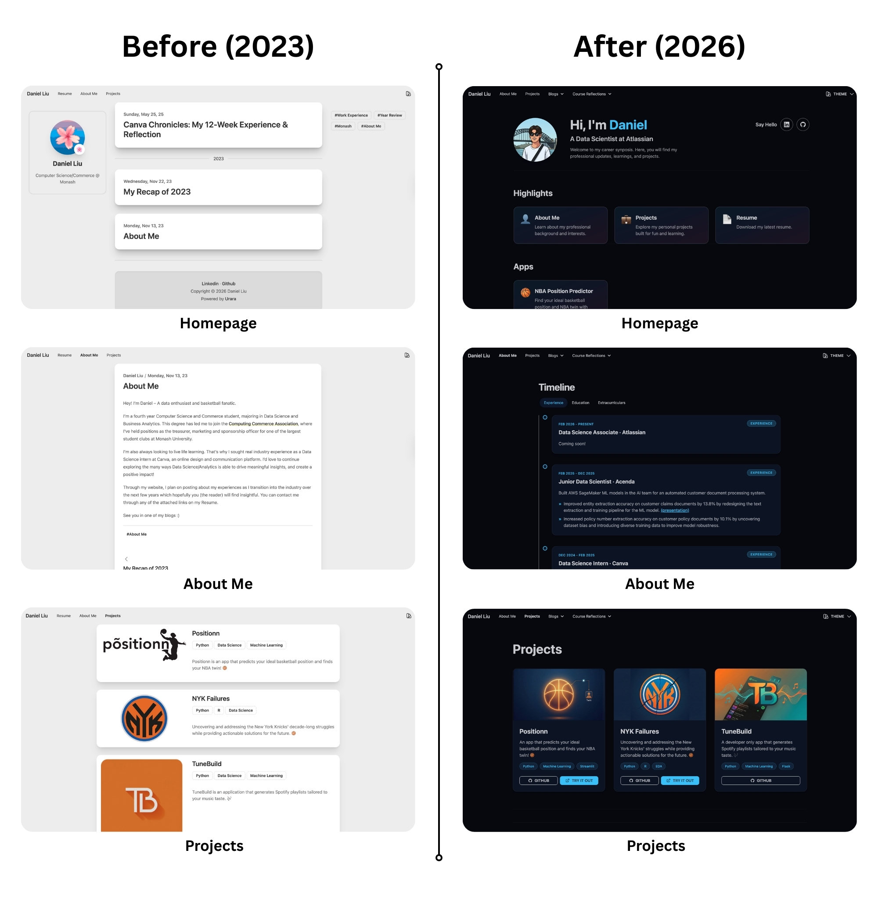

Over the past few days, I've embarked on a comprehensive redesign and improvement of my personal website. What started as a simple portfolio site has evolved into a fully-featured platform showcasing my projects, blog posts, and professional journey. This blog post hopes to document the design and technical decisions and lessons learned throughout the journey.

---

## The Starting Point: Inspiration and Foundation

### Drawing Inspiration from Sai's Website

I initially took inspiration from [Sai's website](https://www.saikumarmk.com/), which is also built using the [Urara](https://github.com/importantimport/urara) template. However, while Sai's site provided a solid foundation and aesthetic direction, I made significant changes to tailor the website to my own preferences and needs, which I will later discuss in detail.

### Why Urara and SvelteKit?

I chose Urara as my foundation because:
1. **Static site**: Suitable for a simple blog/portfolio site
2. **Markdown support**: Useful for easy and clean blog posts
3. **Tailwind CSS + DaisyUI**: Rapid UI development with beautiful components

---

## Design Decisions and Implementation

### Before (2023) & After (2026)

Logging into my site in 2026, I felt it was outdated and aesthetically displeasing. I wanted to do something about this, but lacked the design or front-end skills necessary to make significant deviations from the boilerplate template. How did I overcome this? It's simple, I began taking advantage of the AI capabilities of Cursor.  

After countless hours of tinkering with new designs and features, I'm proud to showcase the significant strides my personal website has taken since its inception in 2023.

  


### Homepage Layout Redesign

Hopefully, everyone agrees that the UI is significantly improved. To achieve the desired look, the homepage went through several iterations before settling on the final structure:

**Final Layout:**
1. **Intro Section**: Profile picture, personalized greeting ("Hi, I'm Daniel"), professional subtitle, and bio
2. **Highlights**: Quick-access cards for key professional pages (About Me, Projects, Resume)
3. **Apps Section**: Dedicated space for my created applications
4. **Latest Posts**: Grid of the four most recent blog posts

**Key Design Choices:**
- **Spacing and Dividers**: Added subtle horizontal dividers between sections to create visual separation without being too heavy
- **Responsive Design**: Ensured all sections work seamlessly on mobile and desktop
- **Social Links Placement**: Positioned "Say Hello" section with LinkedIn and GitHub icons

### About Me Page: From Blog Post to Interactive Timeline

The About Me page transformation was one of the most significant changes:

**Before**: A simple markdown blog post  
**After**: An interactive, tabbed timeline with three sections:
- Experience (default)
- Education
- Extracurriculars

**Implementation Details:**
- Each timeline entry is a card with:
  - Category badge (EXPERIENCE/EDUCATION/EXTRAS) in the top-right corner
  - Date range with primary color accent
  - Bold title for hierarchy
  - Description with bullets (`&raquo;`) instead of standard list items
  - Adjusted text opacity (80% for descriptions) for better contrast

**Why This Design?**
- **Better UX**: Users can quickly filter by category
- **Visual Hierarchy**: Clear distinction between different types of experiences
- **Professional Appearance**: Timeline format is familiar and easy to scan
- **Mobile-Friendly**: Cards stack vertically on smaller screens

### Projects Page: Modern Grid with Dual Actions

The projects page received a complete visual overhaul:

**Before**: A simple list of my projects with basic links  
**After**: A grid layout with improved project cards featuring:
- Responsive 3-column grid (1 column on mobile,  3 on desktop)
- Project cards with images, titles, descriptions, and technology tags
- Action buttons: GitHub and "Try it out"
- Hover effects

**Implementation Details:**
- Each project card includes:
  - New project logo in a container
  - Title and description with proper typography hierarchy
  - Technology tag
  - Two action buttons at the bottom: GitHub and demo link
  - Hover effects: image zoom and title colour change to primary

**Why This Design?**
- **Dual Actions**: Users can either view the code (GitHub) or try the live demo, providing flexibility
- **Visual Consistency**: Cards match the overall site aesthetic with rounded corners and shadows
- **Clear Hierarchy**: Tags and buttons are clearly separated with adequate spacing for better readability

---

## Technical Implementation: API Integration and Deployment

### The NBA Position Predictor Integration

**Motivation:** One of the most interesting technical challenges was integrating my [NBA Position Predictor application](https://www.danielliu.xyz/projects/positionn/) into the website. I had previously created a [streamlit app](https://positionn.streamlit.app/), but it's cold startup (running the app after prolonged downtime) took ~30 seconds. This was unacceptable.  

I decided to reuse my ML models by building a FastAPI backend API and creating a new frontend design that integrates into my personal site. After initial tests, my NBA Position Predictor now takes less than 1 second.  

**Initial Approach**: Embedding the streamlit applicaiton via `<iframe>`
- **Rejected**: Same loading issues as before and lack of design control

**Final Approach**: Native SvelteKit UI with separate FastAPI backend
- **Benefits**:
  - Full control over UI/UX
  - Better performance (~30 seconds -> ~0.5 seconds)
  - Seamless integration with site design

**Implementation:**
- Connected to an external FastAPI backend deployed at `https://positionn-api.fly.dev`. The code can be found in my [positionn repo](https://github.com/danielliu2707/positionn). FastAPI was chosen for its straightforward deployment process across most API hosting providers.
- Created `/projects/positionn` route with a custom SvelteKit page
- Two input modes: Player Statistics and Player Dimensions
- Client-side validation with range checking (e.g., 0-80 for points, 100-250cm for height)
- Info tooltips explaining valid ranges for each field

### API Provider Journey: From Render to Fly.io

The backend deployment process then involved evaluating multiple hosting providers:

**Render (Initial Choice)**
- **Pros**:
  - Free
  - Simple deployment: auto-deploys with GitHub commits
- **Cons**:
  - Very slow cold starts (~50 seconds)
  - Costs ~$19/month for the API to run continually (i.e. no cold starts)

**Fly.io (Final Choice)**
- **Pros**:
  - **Cost-Effective**: ~$3/month for a 512MB RAM, 1 shared CPU instance
  - **Low Cold Starts**: ~0.8 seconds
  - **Auto-Stop Configuration**: Machines suspend when idle, saving money
  - **Scalability**: Easy to adjust resources (e.g., 256MB to 512MB RAM)
  - **Simple Deployment**: Command-line based, straightforward workflow
- **Cons**:
  - **No auto-deploy**: No auto-deployment with GitHub commits (at least I couldn't find it)

**Configuration Details:**
```toml
auto_stop_machines = suspend  # Saves money when idle. Not running 24/7.
min_machines_running = 0   # Can scale to zero
cpu_kind = "shared"        # Cost-optimised
cpus = 1                   # Adequate for ML model
memory_mb = 512            # Adequate for ML model
```

**Trade-offs:**
- ✅ Low cost (~$0.50-2/month with suspension of machines)
- ✅ Acceptable cold start time (~0.8 seconds)
- ❌ No automatic GitHub deployment (manual `fly deploy` required)
- ❌ Slightly more setup than fully managed platforms

**Deployment Process:**
1. Login: `fly auth login`
2. Launch: `fly launch` (uses existing `fly.toml`)
3. Deploy: Automatic or manual `fly deploy`
4. Monitor: `fly logs` and `fly status`

The manual deployment process, while not as seamless as GitHub, is straightforward enough that redeploying model improvements only takes a few terminal commands.

---

## Development Challenges and Solutions

### Theme Management: Preventing Flash

**Problem**: Theme would flash from dark to light on page load
**Root Cause**: Theme was being set in JavaScript after the page load, causing a flash

**Solution**:
1. Added a blocking script in `app.html` that reads `localStorage` and sets `data-theme` synchronously in the `<head>`
2. Initialised theme state in the header component by reading the `data-theme` attribute

### Multiple Page Component Conflicts

**Problem**: `Multiple page component files found in src/routes/about_me : +page.svelte and +page.svelte.md`
**Root Cause**: Urara's `pnpm build` was copying markdown files from `urara/` to `src/routes/`, conflicting with manually created Svelte pages
**Solution**: Removed the source markdown file from `urara/about_me/` to prevent conflicts

### Image Path Management

**Challenge**: Non-consistent relative vs. absolute paths for images in markdown files
**Solution**: Used relative paths within each blog, ensuring images are copied correctly during the build process

---

## Key Learnings and Best Practices

### 1. Start with a Template, Customize Extensively

Using Urara as a foundation saved significant time, but the magic came from personalisation. Don't be afraid to deviate from the template to match your vision.

### 2. Prioritise User Experience

Every design decision should consider:
- **Mobile responsiveness**: Test on multiple screen sizes
- **Loading performance**: Reduce running time and consider cost-tradeoffs 
- **Visual hierarchy**: Clear distinction between content types

### 3. API Provider Selection Criteria

When choosing a hosting provider for APIs:
- **Cold start time**: Critical for user experience
- **Cost**: Balance between features and budget
- **Ease of deployment**: Consider your workflow preferences
- **Scalability**: Plan for future growth

### 4. Version Control and Deployment

- **Git**: Use feature branches for major changes
- **Commit messages**: Be descriptive about what changed and why. This comes in handy when developing over many years

---

## Future Improvements

While the website is now fully functional, there are always opportunities for enhancement:

1. **Performance Optimization**:
   - Image optimization (compress and use responsive images for different screen sizes) and lazy loading (load images when they enter viewpoint to reduce initial page load time)

2. **API Enhancements**:
   - Add more applications
   - Implement caching strategies to reduce API response time. Repeated requests for identical inputs return cahced results

---

## Conclusion

Building this personal website has been an incredibly rewarding experience. From initial inspiration to final deployment. The journey through different API providers, design iterations, and technical challenges has provided valuable insights that I'll carry forward into future projects.  

The website now serves as both a portfolio and summary of my professional journey. It's a project that intend to evolve as I advance in my career.  

If you're building your own personal website, I hope this post provides some useful insights and inspiration.
